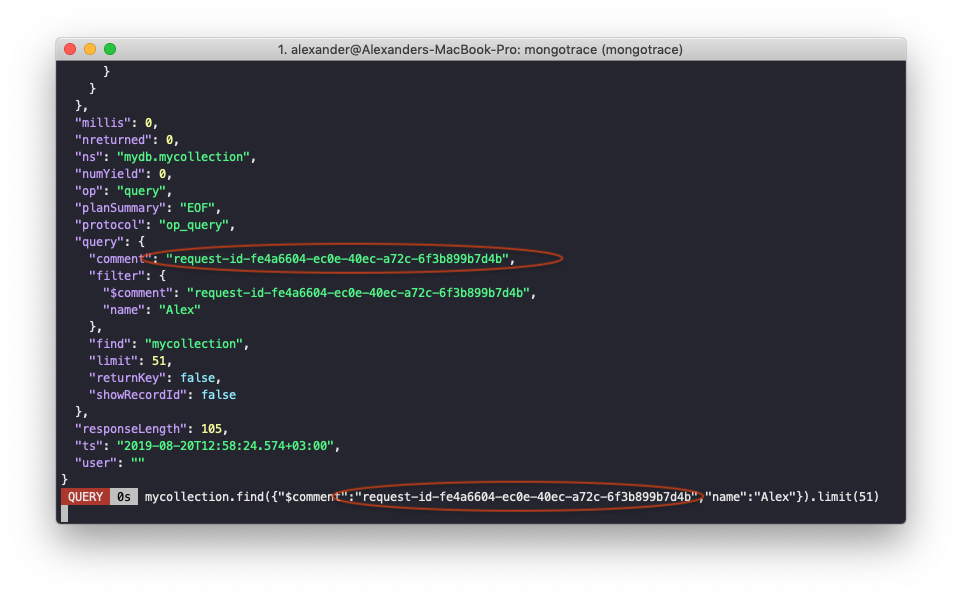
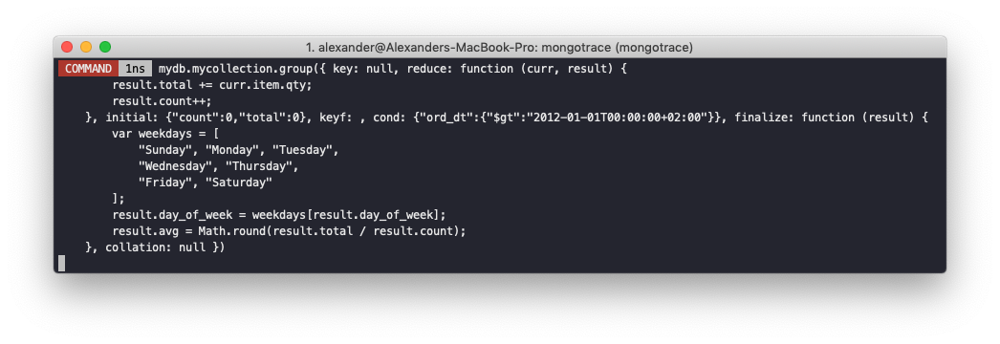

# Mongotrace
Tool for printing information about the current operations executing on the MongoDB.

# Main features

- Enable/disable logging on MongoDb instances
- MongoDb clusters support
- Confugurable
- Formatt MongoDb queries

Tested on: mongodb v4.0.11

# How it looks





# Build

```shell
make build
make install
```

# Usage examples

```shell
mongotrace enable --config="./confs/config.local.json"
mongotrace disable --config="./confs/config.local.json"
mongotrace tail --config="./confs/config.local.json"
mongotrace tail --config="./confs/config.local.json" --debug
mongotrace tail --config="./confs/config.local.json" --raw
```
